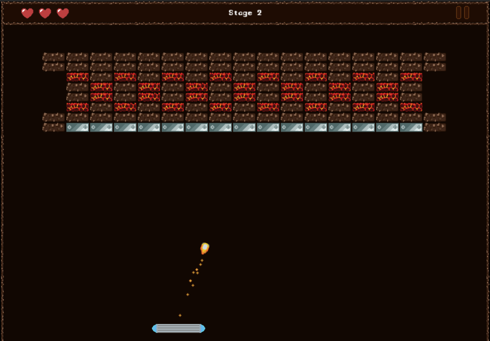
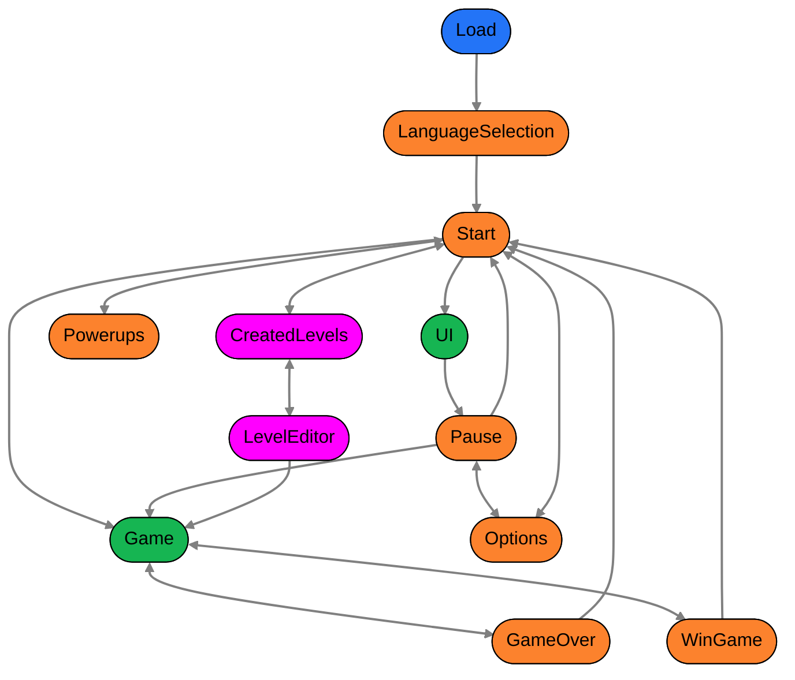

# Breakout with Pahser 3



live demo: https://breakoutphaser.netlify.app/

## Index
- [Running and building the project](#running-and-building-the-project)
- [Debug](#debug)
- [Scenes](#scenes)

## Running and building the project
Install the dependencies
```bash
npm install
```
To start a development server, run
```bash
npm start
```
To bundle up the project run
```bash
npm run build
```
The build artifacts will be stored in the `./dist` directory.

## Debug
Locate the debug object in `./src/scripts/debug.ts`, edit the values to test one or more behaviors.
```javascript
const debug = {
    physics: false,
    level: false, // false, 2, 3, 4 ...
    fireBall: false,
    cannons: false,
    holdBall: false,
    shortPaddle: false, // either short or long, cant be both
    longPaddle: false,
    ctxMenu: false,
}
```

## Scenes
Representation of the scene flow
